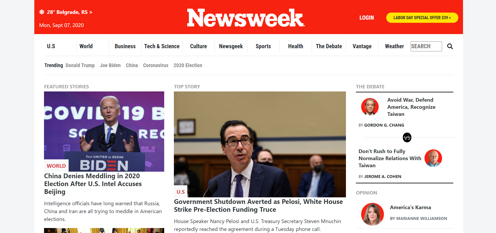

# Newsweek Cloned

> Made as the seventh HTML/CSS project in the Microverse curriculum as a practice for web responsiveness using Bootstrap.

## Built With

- HTML5
- CSS3
- Bootstrap

## Live Demo

[Live Demo Link](https://karmaester.github.io/Newsweek-Cloned/)

## Authors

👤 **karmaester**

- Github: [@githubhandle](https://github.com/karmaester)
- Twitter: [@twitterhandle](https://twitter.com/karmaendlich)
- Linkedin: [linkedin](https://www.linkedin.com/in/khristian-rojas/)

👤 **ricardomonte**

- Github: [@githubhandle](https://github.com/ricardomonte)
- Twitter: [@twitterhandle](https://twitter.com/ramnkco)
- Linkedin: [linkedin](https://www.linkedin.com/in/ricardo-antonio-montenegro-nu%C3%B1ez-87a74944/)

## 🤝 Contributing

Contributions, issues and feature requests are welcome!

Feel free to check the [issues page](https://github.com/karmaester/Newsweek-Cloned/issues).

## Show your support

Give a ⭐️ if you like this project!

## Acknowledgments

- Inspired on the Newsweek web site.
https://www.newsweek.com/

## 📝 License

This project is [MIT](lic.url) licensed.
